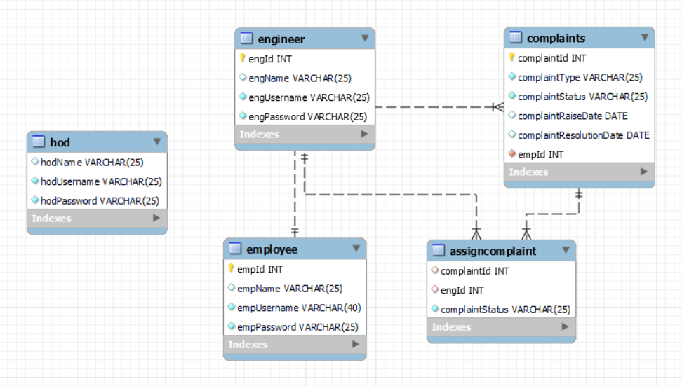

<h1 align="center">Online Hardware And Software Support System🖥️</h1>

# Description:

 The system will be available on an online platform for 24x7 access to the employees, the engineers, the Head of the Department and the administration. It Helps keeping your IT staff productive with fast, accurate, remote technical support for your System environment. It provides defect support for a broad range of Products running on System hardware.

Factors to consider include cost of downtime, skills, retention, overheads, customer satisfaction, and many others. Employees of the organization uses IT based hardware for their daily work. If by some reason, these hardware goes down it is very important to take care of these hardware and in case of fault, that should be repaired in priority basis. To maintain and support these hardwares there exists a separate department, generally known as “SYSTEM ENGINEERS DEPARTMENT”. For any problem, concerned employee must report to this department. Engineers from this department take care of the problem.

***There are 3 users in the system:***
 
 
<b>1.</b> HOD
 
<b>2.</b> Engineer
 
<b>3.</b> Employee

# The Roles for HOD: 
1. Login into the system 
2. Register a new Engineer with a username(email) and password and the category (Hardware/software)
3. Can see List of all the Registered Engineers.
4. Can Delete any Engineers from the system
5. Can able to see all the raised problem.
6. Can assign any problem to any Engineer.

# The Roles of Engineer:
1. Each engineer has their own account by which they can login.(credentials given by the HOD)
2. Engineer can view the problem assigned to him by HOD .
3. Engineer can update the status of the problem addressed by him . i. e. whether it solved or any thing .
4. They can see list of all the problems attended by him/her.
5. Engineer can change his password.

# The Roles of Employee:
1. Employee can register himself with his username and password.
2. Each employee has their account in the system with which they can login
3. Employee can register any complain (hardware / software ) through the system. After registering the complain a complain id is generated by the system.
4. Employee can see the status of their problem by using complain id . Status means they can check who (engineer) is assigned to his problem.
5. They can see all complain history raised by him/her.
6. Employee can change his/her password.

# ER DIAGRAM:

 

  

# Tables:
<pre>
create table <b>HOD</b>(
    hodName varchar(25),
    hodUsername varchar(25) unique not null,
    hodPassword varchar(25) not null
);
</pre>
<pre>
create table <b>EngineeringDepartment</b>(
    deptId int primary key auto_increment,
    deptName varchar(25) not null
);
</pre>
<pre>
create table <b>Engineer</b>(
    engId int primary key auto_increment,
    engName varchar(25),
    engUsername varchar(25) unique not null,
    engPassword varchar(25) not null,
    deptName varchar(25)
);
</pre>
<pre>
create table <b>Employee</b>(
    empId int primary key auto_increment,
    empName varchar(25),
    empUsername varchar(25) unique not null,
    empPassword varchar(25) not null,
    deptId int,
    foreign key (deptId) references EngineeringDepartment(deptId) on update cascade on delete cascade
);
</pre>
<pre>
create table <b>Complaints</b>(
    complaintId int primary key auto_increment,
    complaintType varchar(25) not null,
    complaintStatus varchar(25) not null,
    complaintRaisedDate date,
    complaintResolutionDate date,
    empId int not null,
    engId int not null,
    foreign key (empId) references Employee(empId) on update cascade on delete cascade,
    foreign key (engId) references Engineer(engId) on update cascade on delete cascade
);
</pre>

# DESCRIBE (DESC) TABLES:

<b># DESC HOD</b>
-----------------
<pre>
+-------------+-------------+------+-----+---------+-------+
| Field       | Type        | Null | Key | Default | Extra |
+-------------+-------------+------+-----+---------+-------+
| hodName     | varchar(25) | YES  |     | NULL    |       |
| hodUsername | varchar(25) | NO   | PRI | NULL    |       |
| hodPassword | varchar(25) | NO   |     | NULL    |       |
+-------------+-------------+------+-----+---------+-------+
</pre>
<b># DESC ENGINEERINGDEPARTMENT</b>
-----------------------------------
<pre>
+----------+-------------+------+-----+---------+----------------+
| Field    | Type        | Null | Key | Default | Extra          |
+----------+-------------+------+-----+---------+----------------+
| deptId   | int         | NO   | PRI | NULL    | auto_increment |
| deptName | varchar(25) | NO   |     | NULL    |                |
+----------+-------------+------+-----+---------+----------------+
</pre>
<b># DESC ENGINEER</b>
----------------------
<pre>
+-------------+-------------+------+-----+---------+----------------+
| Field       | Type        | Null | Key | Default | Extra          |
+-------------+-------------+------+-----+---------+----------------+
| engId       | int         | NO   | PRI | NULL    | auto_increment |
| engName     | varchar(25) | YES  |     | NULL    |                |
| engUsername | varchar(25) | NO   | UNI | NULL    |                |
| engPassword | varchar(25) | NO   |     | NULL    |                |
| deptName    | varchar(25) | YES  |     | NULL    |                |
+-------------+-------------+------+-----+---------+----------------+
</pre>
<b># DESC EMPLOYEE</b>
----------------------
<pre>
+-------------+-------------+------+-----+---------+----------------+
| Field       | Type        | Null | Key | Default | Extra          |
+-------------+-------------+------+-----+---------+----------------+
| empId       | int         | NO   | PRI | NULL    | auto_increment |
| empName     | varchar(25) | YES  |     | NULL    |                |
| empUsername | varchar(25) | NO   | UNI | NULL    |                |
| empPassword | varchar(25) | NO   |     | NULL    |                |
| deptId      | int         | YES  | MUL | NULL    |                |
+-------------+-------------+------+-----+---------+----------------+
</pre>
<b># DESC COMPLAINTS</b>
------------------------
<pre>
+-------------------------+-------------+------+-----+---------+----------------+
| Field                   | Type        | Null | Key | Default | Extra          |
+-------------------------+-------------+------+-----+---------+----------------+
| complaintId             | int         | NO   | PRI | NULL    | auto_increment |
| complaintType           | varchar(25) | NO   |     | NULL    |                |
| complaintStatus         | varchar(25) | NO   |     | NULL    |                |
| complaintRaisedDate     | date        | YES  |     | NULL    |                |
| complaintResolutionDate | date        | YES  |     | NULL    |                |
| empId                   | int         | NO   | MUL | NULL    |                |
| engId                   | int         | NO   | MUL | NULL    |                |
+-------------------------+-------------+------+-----+---------+----------------+
</pre>

**Teck Stack :** Core Java, JDBC, SQL.
 

**Softwares and Tools :**  MYSQL, STS, GitBash

<h1 align="center"><b>THANK YOU</b></h1>
